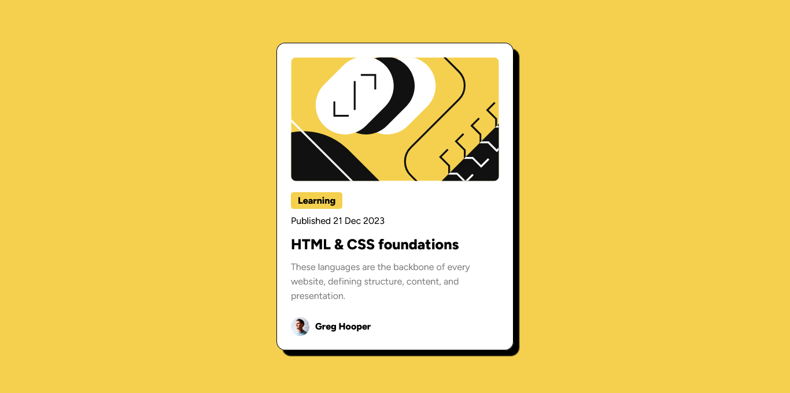

## Table of contents

- [Overview](#overview)
  - [The challenge](#the-challenge)
  - [Screenshot](#screenshot)
  - [Links](#links)
- [My process](#my-process)
  - [Built with](#built-with)
  - [What I learned](#what-i-learned)
  - [Continued development](#continued-development)
  - [Useful resources](#useful-resources)
- [Author](#author)
- [Acknowledgments](#acknowledgments)

## Overview

### The challenge

Users should be able to:

- See hover and focus states for all interactive elements on the page

### Screenshot



### Links

- Solution URL: (https://github.com/alimassidik210/blog-preview-card.git)
- Live Site URL: (https://blog-preview-card-neon-sigma.vercel.app/)

## My process

### Built with

- Semantic HTML5 markup
- CSS custom properties
- Flexbox

### What I learned

In this project, I am learning how to use Google Fonts in a CSS project.

To see how you can add code snippets, see below:

```html
<link
  rel="icon"
  type="image/png"
  sizes="32x32"
  href="./assets/images/favicon-32x32.png"
/>
```

```css
@font-face {
  font-family: "Figtree";
  src: url(./assets//fonts/static/Figtree-ExtraBold.ttf) format("truetype");
  font-weight: 800;
  font-style: normal;
}
```

### Continued development

"In the next project, I want to use SASS to make writing CSS code simpler."

### Useful resources

- [CSS Documentation](https://www.w3scholl.com) - - This resource provided comprehensive information on using CSS.

## Author

- Website - [alim assidik](https://mini-portfolio-yp8m.onrender.com)
- Frontend Mentor - [@alimassidik210](https://www.frontendmentor.io/profile/alimassidik210)
- Instagram - [@alim.assidik210](https://www.instagram.com/alim.assidik210)

## Acknowledgments

I would like to express my gratitude to the following individuals for their invaluable contributions to this project:

- [abdul latif] - Provided guidance and support throughout the development process.
- [sandika galih] - Inspired me with their innovative approach to problem-solving.
- [Frontend mentor web] - Their insights and feedback significantly improved the final outcome.

Thank you all for your dedication and commitment to making this project a success.
